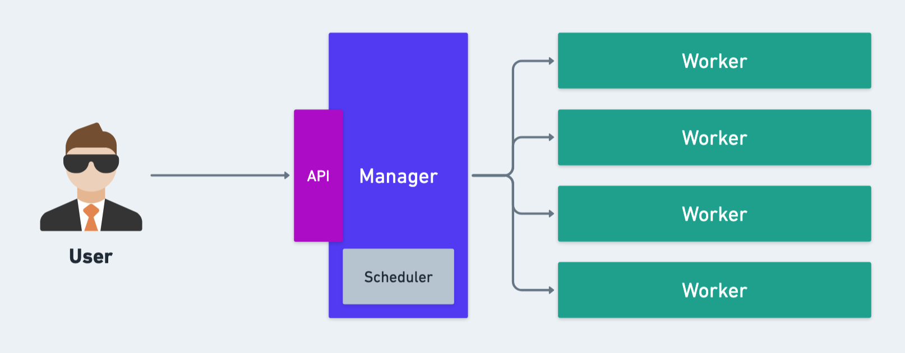

# Cube

A minimal container orchestrator written in Go. I wrote this tool from scratch reproducing the code accompanying the book [Build an Orchestrator in Go from Scratch](https://www.manning.com/books/build-an-orchestrator-in-go-from-scratch) by Tim Boring. It's an excellent book by Manning and I highly recommend it.

## In This Document:
  - [Motivation](#motivation)
  - [Tools](#tools)

## Motivation
  - It was 2017 when I first used [Kubernetes](https://kubernetes.io/) as a software engineer at [IQNavigator/Beeline](https://www.beeline.com/). Since then I wanted to gain a deep understanding of this powerful system for cloud native deployment. 
  - Fast forward to 2024 when I got [Kubernetes and Cloud Native Certified](https://www.credly.com/badges/5aaee950-9699-4af8-b636-c80db13a544c/public_url) and taught Cloud Native DevOps using Kubernetes. 
  - I eventually decided that it was time to open up the black box and peek inside. I wanted to build an orchestrator myself, and came across [the excellent book by Tim Boring](https://www.manning.com/books/build-an-orchestrator-in-go-from-scratch). 
  - I'm glad I took the time to build this minimal orchestrator, using Go.

## Tools 
1. Programming Language: [Go](https://go.dev/)
2. Development Environment: [Linux - CentOS Stream 9](https://www.centos.org/download/)

